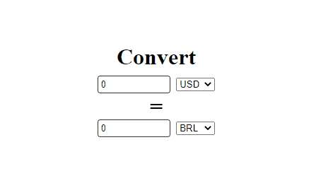

## Simple Currency Converter made with React
Simple React App to cover some basics of API Call, useEffects, useStates abd Props 

## API
> Currency API: https://exchangeratesapi.io/

## References
> Web Dev Simplified Youtube Video - https://www.youtube.com/watch?v=XN5elYWiSuw

## Available Scripts
In the project directory, you can run:

### `yarn start`

Runs the app in the development mode. 
Open [http://localhost:3000](http://localhost:3000) to view it in the browser.

The page will reload if you make edits. 
You will also see any lint errors in the console.
